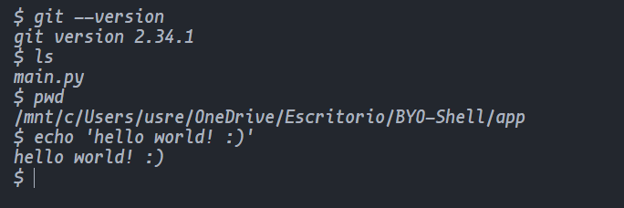

# BYO-Shell

BYO-shell is a project developed as part of the "Build Your Own Shell" challenge in [CodeCrafters](https://app.codecrafters.io/courses/shell/overview). It represents the learning process of creating a POSIX-compliant shell from scratch.

## Implemented Functions

- **exit**: Closes the shell with an optional exit code.
- **echo**: Prints provided arguments to the standard output.
- **type**: Indicates whether a command is built-in or its path on the system.
- **pwd**: Shows the current working directory.
- **cd**: Changes the working directory, with support for relative paths, absolute paths, and home (~).

### External Program Execution

Allows running commands and programs available on the system.

### Output and Error Redirection

- **>** and **>>**: Redirect standard output to a file (overwriting or appending).
- **2>** and **2>>**: Redirect standard error output to a file (overwriting or appending).

### Example Usage


## How to Run

1. Clone the repository.
2. Run the following command in the app directory:
```bash
python3 main.py
```

